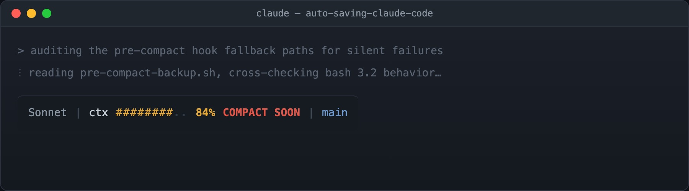

Git records what you decided. It says nothing about what you rejected.

That asymmetry is fine for code written by hand, where the alternatives never left your head anyway. It's a real loss for code written across a long agent session, because the reasoning trail is substantial: the approach that looked right for twenty minutes before a constraint killed it, the library you evaluated and dropped, the three failure modes you found and designed around. That work happened. It shaped the code. And it lives in exactly one place — the conversation.

Then the context window fills, auto-compaction fires, and the conversation becomes a few hundred tokens of summary.

Below is a two-layer system that archives the raw transcript automatically: no daemon, no database, no service to keep running, nothing to install but `jq`. Layer 1 is opportunistic — a status line that checkpoints in the background once you cross a threshold. Layer 2 is guaranteed — a hook that fires exactly once, right before compaction, regardless of what layer 1 did.

# What compaction actually does

Compaction compresses what the *model* sees. It does not delete anything on disk.

Claude Code writes every session to plaintext JSONL at `~/.claude/projects/<encoded-cwd>/<session-id>.jsonl` — one JSON event per line, covering prompts, responses, and every tool call. That file keeps growing straight through a compaction event. `/resume` and `/export` both read from it.

Worth being precise about, because it changes what problem you're solving. You are not rescuing data from deletion. You are fixing four narrower things:

1. **Retention is 30 days by default.** `cleanupPeriodDays` defaults to 30, cleanup runs at startup, and deletion is a hard `unlink()` — no trash, no warning, no recovery.
2. **Storage is keyed by encoded working directory in a global folder.** Move or rename the project and the association breaks.
3. **Compaction boundaries aren't marked.** Nothing in the raw file tells you where the agent's working memory got flattened — which is precisely the point you want to inspect when it starts relitigating a question it had already settled.
4. **`/export` is manual, one session at a time.** That does not survive contact with a real week.

The goal is converting a volatile, path-keyed, 30-day cache into a durable, project-local, annotated, greppable record.

# Layer 1: the status line as an instrument

Claude Code's `statusLine` runs a shell command and renders its first line of stdout at the bottom of the terminal. It re-runs whenever conversation messages update — throttled to at most every 300ms — and a `refreshInterval` can re-run it on a timer as well. It receives a JSON payload on stdin containing `session_id`, `transcript_path`, `model`, `workspace`, and a `context_window` object with token counts.

That's a fill gauge *and* a trigger that already has the transcript path in hand. So the status line does two jobs: it shows you where you are, and past a threshold it starts checkpointing in the background.



Mine fires at 80% of the real compact budget, throttled to once per five minutes per session, with a lockfile so concurrent invocations don't interleave writes.

Two implementation details that cost me time. Anything the script prints to stdout *becomes* your status line, so background the backup and discard its output. And the throttle needs a lockfile rather than a timestamp check — the status line can re-enter faster than a backup completes.

# The budget math, and why `used_percentage` misleads

The payload includes `context_window.used_percentage`, which is the obvious field to threshold on. On my setup it consistently disagrees with the "% until auto-compact" indicator in the UI, and it disagrees in the dangerous direction: it reads low.

The reason appears to be that auto-compaction doesn't wait for the window to fill. It triggers at roughly 84% of the window, reserving the remainder for the compaction pass itself. `used_percentage` is computed against the *full* window, so it measures the wrong denominator.

The correction is a division:

```
budget_used = (cache_read_input_tokens
             + cache_creation_input_tokens
             + input_tokens)
             / (context_window_size * 0.84) * 100
```

The important part is that this is a *multiplicative* factor, not a fixed offset. The gap widens as you fill, and it is widest exactly where being wrong costs the most:

| `used_percentage` reads | Actual budget consumed | Gap |
|---|---|---|
| 40% | 48% | 8pp |
| 60% | 71% | 11pp |
| 78% | 93% | 15pp |
| 84% | 100% — compaction fires | 16pp |

At 78% you feel like you have a fifth of the session left. You have about 7%. That misread is what makes a naive threshold fire after compaction rather than before it.

# Layer 2: PreCompact as the backstop

The status line is opportunistic. It only runs when messages update, and it's throttled. A single large tool result can consume the remaining budget between two invocations.

The guarantee comes from the `PreCompact` hook, which fires immediately before compaction and receives the same `session_id` and `transcript_path` on stdin. No throttle, synchronous, one job. Its matcher distinguishes `auto` (the window filled) from `manual` (you ran `/compact`).

Neither layer is load-bearing alone. That's the design: two independent triggers with different failure modes, writing through one shared, idempotent writer.

Backups land in `claude_chat_backup/auto_backup_<timestamp>_<session_short>.jsonl`. Keying on the session ID is not cosmetic — run three agents against one repo and timestamped filenames collide under concurrency, interleaving three conversations into noise.

# Where to register it

Hooks go in a settings JSON file, not `CLAUDE.md`. Memory files are instructions loaded into the model's context; a model *asked* to back up your transcript usually will, which is not the same as it always happening. Hooks are deterministic. That's the point.

The documented scopes are:

| File | Scope |
|---|---|
| `~/.claude/settings.json` | user, all projects |
| `.claude/settings.json` | project, committed |
| `.claude/settings.local.json` | project, gitignored |

Claude Code validates these strictly, which is why unknown keys disappear rather than erroring — useful to know before you spend an hour debugging a hook that never fires.

Verify where yours actually loaded from. Run `/status` and read the "Setting sources" line, then `/hooks`, which lists every registered hook and the file it came from. A hook in an unrecognized scope doesn't warn you. It silently isn't there, and you find out on the day you needed it.

# What this is like to use

The backup layer is invisible, which is correct. You notice it twice: once when you set it up, and once weeks later when you need something out of it.

The status line is the part you interact with, and it changed how I work more than the archive did. A fill gauge turns an invisible resource into a visible one, and visible resources get budgeted. You stop opening a large exploratory question at 70%. You start a fresh session for the unrelated tangent instead of paying for it out of the current window. When the bar goes amber you wrap the current thread rather than starting a new one and losing it mid-flight.

None of that requires the backups. It's a second-order benefit of instrumenting the resource at all, and it may be the larger one.

# The audit trail

Weeks out, the question is rarely "what does this code do." It's "why is it like this."

Git answers a narrow version. The commit shows the final shape; the message shows what you thought was worth writing down at the time. Neither captures the two hours where you established that the obvious approach deadlocks under concurrent writes — the reason the non-obvious approach exists at all.

An archived transcript answers it directly, and the queries are boring in a good way. This one searches every prompt in every backed-up session for a keyword, so you can find the conversation that touched a topic without remembering which session it was in:

```bash
# every prompt across every session touching a topic
jq -r 'select(.type == "user")
       | [.timestamp,
          (.message.content
           | if type == "string" then .
             else (map(.text? // "") | join(" ")) end)]
       | @tsv' claude_chat_backup/*.jsonl \
  | grep -i "idempotency"
```

Three uses that have earned their keep:

**Reconstructing a decision.** Find where a design turned, read the surrounding twenty exchanges, recover the constraint you'd forgotten. This is the one I expected.

**Recovering rejected work.** Agents produce a lot of code that gets discarded for reasons that later stop applying. That code is in the transcript, and it's often a better starting point than writing it again.

**Auditing the agent, not just the output.** Reading a long session end to end shows you where it drifted, where it over-claimed, where it quietly dropped a requirement. That's a different signal from reviewing the diff, and it's the one that improves how you prompt.

Log the compaction points alongside the transcript and you get one more thing: a marker for where the agent's working memory was flattened. When a session goes sideways, that boundary is usually near the cause.

# Caveats

**Never set `cleanupPeriodDays: 0`.** The documented meaning is "disable cleanup," but it has been reported to disable transcript persistence entirely — no JSONL, no `/resume`, no hook input. That's silent data loss in the one setting that looks like it should be the safest choice. Use a large number instead.

**The transcript is flushed asynchronously.** Anthropic's documentation is explicit that the file can lag the in-memory conversation, so the most recent turn or two may be missing when a hook fires. A short sleep before reading mitigates it. It does not guarantee it.

**`PreCompact` has had reliability bugs**, including not firing on manual `/compact` and receiving an empty `transcript_path` in some versions. This is why layer 1 exists. Don't collapse to one trigger.

**The 0.84 is undocumented and will drift silently.** When it changes there's no error — the bar quietly misaligns and layer 1 starts firing late. Compute the ratio against `used_percentage` on every run and log divergence. That turns a magic constant into a self-checking one.

**The JSONL line schema is internal.** Pin whatever you build on top of it and re-check after upgrades.

**These files contain everything you ever pasted into that terminal.** Gitignore the backup directory before the first run. Gitignore alone isn't sufficient: if the directory sits inside the repo, the agent's own Grep and Glob will traverse it and read prior transcripts back into context. Add a deny rule or store it outside the tree.

# What this doesn't solve

Backups are retrieval, not context management. They help when you know what you're looking for, weeks later.

The larger win inside a single session is different: keep the plan, the constraints, and the rejected approaches in a working file the agent re-reads, rather than in conversation it has to remember. Do that and compaction stops mattering much — the agent re-reads a few hundred tokens and is fully oriented. Same window, different failure mode entirely.

Archiving is what you do so the record survives. Externalizing state is what you do so you need the record less often.

Treat the session transcript like a write-ahead log. The context window is a bounded resource with a real failure mode, the log is already being written to disk, and the hooks to checkpoint and keep it are sitting right there in the tooling. It just takes a little plumbing.

Full scripts: [`statusline.sh`](statusline.sh) · [`pre-compact-backup.sh`](pre-compact-backup.sh)
