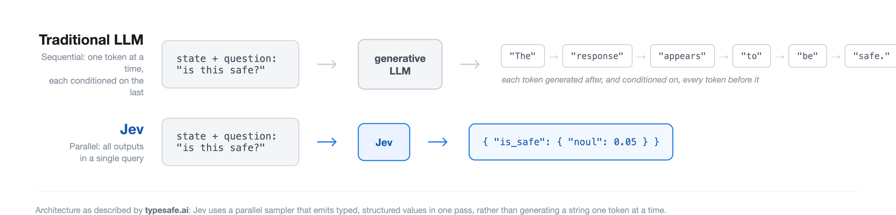

*First in a two-part series on tuning [Jev](https://openrouter.ai/typesafe/jev-1.13) as an LLM judge: this post covers judging response quality; the next covers judging response safety.*

Jev is a structured decision model from TypeSafe, available on OpenRouter. Send it application state and a typed question, and it returns a typed answer with a probability attached, not generated text. No chain of thought, no explanation, no free-form output at all. The hypothesis is that for a narrow yes/no or multiple-choice call, a purpose-built decision model beats a generative LLM on cost and speed without giving up much accuracy.

That's a testable claim, so I tested it: tuned Jev as a quality judge on a real dataset, benchmarked it against two low-cost general-purpose LLMs on the same held-out data, and built a hybrid that escalates to a reasoning model when Jev's answer isn't enough on its own. This post outlines what actually happened, including the parts that didn't work on the first try.

# What Jev actually is



The entire request surface is three fields: `state` (a string or JSON object, the context to judge), `questions` (a dictionary of typed questions), and some optional metadata. A question is one of three primitives: `noul` (yes/no), `choice` (pick one of several options), or `score` (rank on an ordered scale). Here's a real request I sent it, judging whether a translated email preserves the nuance of the original:

```json
{
  "model": "typesafe/jev-1.13",
  "state": {
    "instruction": "...translate this email into English for my boss...",
    "response": "The translated English email...L'union fait la force..."
  },
  "questions": {
    "is_high_quality": {
      "type": "noul",
      "instructions": "Is the response capable of precise translation and communication in various languages while preserving the substance and finer points of the dialogue?",
      "criteria": {
        "true": "The model translates and communicates in various languages without any flaws, perfectly preserving the substance and nuances.",
        "false": "The model demonstrates no capacity to translate or communicate, or does so incorrectly, losing the substance and finer points."
      }
    }
  }
}
```

The response is `{"is_high_quality": {"noul": 0.31}}`, plus token usage and cost. That's it. There is no field anywhere in this schema for exemplars, conversation history, or worked examples. If you want to give Jev something like a few-shot prompt, there's no supported way to do it, which matters later in this post.

# Turning a 1-5 rubric into a yes/no question

I benchmarked the quality judge on [Feedback-Collection](https://huggingface.co/datasets/prometheus-eval/Feedback-Collection), the dataset built for the Prometheus evaluator-LLM project: 1,000 rubrics, 20,000 instructions, 100,000 GPT-4-scored responses, each on a 1-5 scale with a written description for what each of the five levels looks like. I binarized it: score >3 is high quality, ≤3 is low, with low quality as the positive class, matching the outcome an actual quality gate cares about, correctly catching bad responses. Sampling one response per distinct rubric (996 available, 950 used across dev and test) gets maximum rubric diversity with zero repeats, and lands close to the population's real split: 58% low / 42% high in both the 200-example dev set and the 750-example held-out test set.

Jev's `is_high_quality` question needs a `criteria.true` string, what "high quality" looks like, and a `criteria.false` string, what "low quality" looks like. Feedback-Collection doesn't hand those over directly: its rubric comes as five separate level descriptions, not two buckets. So `criteria.true` had to be built by combining levels 4 and 5 (my "high" bucket) into one string, and `criteria.false` from levels 1 through 3. My first attempt just glued the kept levels' descriptions together with a space and called it done:

> "The model often identifies the emotional context and reacts suitably, with minor cases of misreading or misjudging. The model flawlessly identifies the emotional context of the user's input and consistently responds in a considerate and empathetic manner."

That's level 4's description directly followed by level 5's, no separator, no signal that these are two different reference points. It reads broken because the two levels are written in genuinely different registers: level 4 is hedged, since it's describing "pretty good but not perfect" ("*often* identifies... with *minor cases* of misreading"), while level 5 is absolute, since it's the top rung ("*flawlessly* identifies... *consistently* responds"). Smashed into one sentence, that reads like a single claim flip-flopping between "usually right, sometimes wrong" and "never wrong," an apparent contradiction, when it's really just two rungs on a ladder that got flattened into one. The fix keeps every word from the dataset, unedited, and just labels which rung each sentence came from instead of blending them:

```python
def _leveled_criteria(row, levels):
    return " ".join(
        f"(Level {i}) {row[f'orig_score{i}_description']}" for i in levels
    )
```

`(Level 4) ...often identifies... (Level 5) ...flawlessly identifies...` now reads as two labeled data points on a scale instead of one self-contradicting claim, purely from adding the labels, nothing rewritten.

I deliberately dropped the reference answer that Feedback-Collection was designed to be judged against. The dataset's scores assume a gold answer is available for comparison; a real quality gate usually doesn't have one. Every number in this post is a judge working without a reference, which is the harder and more realistic version of the task.

# Zero-shot: three systems, one held-out test set

Jev against two low-cost-tier LLMs, chosen deliberately over a flagship model: Haiku 4.5 and GPT-6 Luna are both "keep cost down" tiers, so the comparison is honest instead of favoring Jev by pitting it against something expensive. All three ran the same 750-example held-out test set, zero-shot, before any tuning:

| System | Acc | Prec | Recall | F1 | p50 latency | $/call |
|---|---|---|---|---|---|---|
| Jev | 0.765 | 0.865 | 0.706 | 0.777 | 209ms | $0.0000314 |
| Haiku 4.5 | 0.759 | 0.887 | 0.669 | 0.763 | 1748ms | $0.0009215 |
| GPT-6 Luna | 0.681 | 0.695 | 0.802 | 0.745 | 2345ms | $0.0001133 |

Jev leads on both accuracy and F1, zero-shot, before any tuning at all, while being roughly **8-11x faster** and **3-29x cheaper** per call. Quality judging is hard for all three systems here: none of them clears 77% accuracy.

Getting the LLMs to answer at all took a real fix first. Both were prompted with a plain instruction (state the case, restate the criteria, respond in a strict `VERDICT` / `CONFIDENCE` / `REASON` format), and Luna initially failed to parse on 9 of 200 dev calls, always the same way: `output_tokens` pinned exactly at the 200-token cap, `content` an empty string. `quality-128` is typical:

> **Instruction:** Analyse the economic impact of the COVID-19 pandemic on the global aviation industry... supported by accurate data and relevant information.
>
> **Response:** The COVID-19 pandemic has inflicted severe economic damages on the global aviation sector. The International Air Transport Association (IATA) projects a loss of $314 billion for airlines worldwide in 2020, a 55% decline from 2019's figures... [continues through tourism/hospitality ripple effects, long-term connectivity implications, and proposed solutions]
>
> **Criterion:** Is the model fully knowledgeable about the subject matter, delivering precise and pertinent data? (ground truth: score 5, high quality)

Judging this pair against that criterion returned: `finish_reason: "length"`, `content: null`, and `completion_tokens_details.reasoning_tokens: 200`, exactly equal to the 200-token cap. Every completion token went to reasoning, and the reasoning itself is a genuine, substantive evaluation of the response, visible in the API's `reasoning` field, it just never finished converting into the requested `VERDICT` / `CONFIDENCE` / `REASON` answer before the budget ran out. This is a documented failure mode: OpenRouter's own reasoning-tokens guide states it plainly, "if the limit is small enough that the model spends all of it reasoning, the response returns `finish_reason: 'length'` with an empty `content`, and the reasoning tokens are still billed." Raising the cap to 600 tokens fixed all of it, zero parse errors after. Jev can't have this failure mode at all, structurally: it doesn't generate free text, so there's no reasoning process competing with the answer for budget.

# Tuning Jev: the first fix made things worse

Jev's `criteria` text is the only lever that obviously exists, so the first tuning attempt rewrote it. I mined the dev set's false negatives and false positives (highest-confidence-wrong first) and found a real pattern: Jev's misses were mostly *surface-competent-but-shallow* responses, correct facts delivered tersely, generic empathy with no personalization, no follow-up question when the situation called for one. `quality-2` is typical:

> **Instruction:** In an online therapy chatbot program, a user has expressed feelings of loneliness and frustration due to their inability to socialize during a pandemic. The user also mentions struggling with a sense of loss, as they recently lost a beloved pet... ensure the AI model responds... with understanding, empathy, and thoughtfulness.
>
> **Response:** It seems you're feeling lonely due to the pandemic restrictions and you also lost your pet recently, which is quite sad. The current situation is indeed difficult, and it's completely normal to feel isolated. You should try to be active and maybe engage in some hobbies to distract yourself. Even though we're in a pandemic, there are ways to connect with people... If the feelings of loneliness persist, you should consult a professional.
>
> **Criterion:** Is the model able to comprehend and react to emotional signals in the user's language, showing sensitivity and thoughtfulness? (ground truth: score 2, low quality)

Zero-shot Jev rated this 0.60, leaning high quality, wrong. The response acknowledges both things the user said, then defaults to boilerplate, with no follow-up question and no engagement with the specific loss mentioned. I added an explicit instruction targeting exactly that pattern:

> "A response that is superficially competent but generic, non-personalized, or fails to follow through on what the situation actually calls for... should be scored as NOT meeting the high-quality bar, even if nothing in it is factually wrong."

| | Acc | Prec | Recall | F1 |
|---|---|---|---|---|
| Baseline (zero-shot) | 0.700 | 0.792 | 0.655 | 0.717 |
| Tuned, criteria rewrite | 0.670 | 0.667 | 0.862 | 0.752 |

The rewrite fixed `quality-2` (0.60 -> 0.31, now correctly leaning low quality) along with 23 similar cases. But recall jumping from 0.655 to 0.862 came with precision cratering from 0.792 to 0.667, and accuracy actually dropped. `quality-7` shows the mechanism:

> **Instruction:** A user comes to a peer support forum, expressing deep sadness and frustration over a recent job loss. They're feeling anxious about the future... How do you respond to this post in a manner that shows empathy and understanding?
>
> **Response:** I'm really sorry to hear that you're going through such a tough time. Losing a job is definitely a stressful event and it's okay to feel anxious about the future. I just want you to know that it's alright to feel this way. You're more than your job and your skills are still intact. It might be helpful to take some time for yourself and do things you love to help manage your stress... Keep faith in yourself. Things will improve over time.
>
> **Criterion:** Does the response show empathy and understanding towards the user's feelings or situation? (ground truth: score 4, high quality)

Zero-shot Jev correctly rated this 0.84. Tuned Jev drops it to 0.44, wrong. The response is specific to what was said ("You're more than your job and your skills are still intact"), not generic, but it's still built from recognizable comforting phrases and gentle suggestions, exactly the register the new instruction was told to treat as a red flag. The instruction couldn't tell "generic because it's actually shallow" from "sounds familiar because supportive language sounds like other supportive language," and 29 other previously-correct cases broke the same way `quality-7` did.

# What actually worked: exemplars stuffed into `state`

Jev's schema has no exemplar field, so testing few-shot at all meant a workaround: pack 2-3 labeled worked examples into `state` as a `worked_examples` array alongside the real case under a `target` key, and tell the `instructions` field to answer only about `target`. Whether this would move Jev's output at all was a genuine open question. It's a decision model, not a generative transformer, and in-context learning is a documented property of the latter, not obviously something a fundamentally different architecture inherits for free.

On the dev subset, it worked, and cleanly, unlike the criteria rewrite:

| | Acc | Prec | Recall | F1 |
|---|---|---|---|---|
| Baseline (zero-shot) | 0.711 | 0.800 | 0.667 | 0.727 |
| Exemplars via `state` | 0.731 | 0.851 | 0.649 | 0.736 |

(Same dev subset both rows, exemplar source rows excluded from scoring to avoid trivially grading Jev on cases it was shown the answer to.) Accuracy and precision both up, F1 up, recall essentially flat, none of the tradeoff the criteria rewrite forced. That much settles the open question on its own terms: in-context exemplars do move a decision model's output, even without a schema field designed for them, since the predictions on unseen dev cases changed in response to them.

Whether that dev-set improvement was a real, generalizable gain is a separate question, and I froze this config and ran it once on the full 750-example held-out test set specifically to find out, rather than call the numbers used to pick the fix a win:

| | Acc | Prec | Recall | F1 |
|---|---|---|---|---|
| Zero-shot (test) | 0.765 | 0.865 | 0.706 | 0.777 |
| Tuned, exemplars (test) | 0.764 | 0.882 | 0.685 | 0.771 |

The gain didn't hold. Precision up, recall down, accuracy and F1 both a hair below zero-shot: a wash on the actual test set. The dev-set numbers weren't wrong, exemplars did change Jev's answers there, but a dev-set improvement and a generalizing improvement are different claims, and only one of them survived the held-out check. This was one tuning pass with 2-3 hand-picked exemplars, not a search over exemplar sets, so it doesn't rule out that a larger, more representative set generalizes where this one didn't; that's untested here, not ruled out. Jev still leads both LLMs on F1 (0.777 zero-shot, 0.771 tuned, against Haiku's 0.763 and Luna's 0.745) with or without this tuning pass. That's the claim the test set supports, not "tuning helped."

# Consistency: confidence isn't the same as being right twice

I re-ran a fixed 100-example subsample through each system a second time, same frozen config, and checked how often the second pass agreed with the first:

| System | Agreement |
|---|---|
| Jev | 98/100 |
| Haiku 4.5 | 100/100 |
| GPT-6 Luna | 92/100 |

Jev's two flips are boundary noise. `quality-91`:

> **Instruction:** I am an owner of a small tech company that develops mobile applications. Recently, we have been losing our customer base due to the lack of unique features in our apps... propose a creative, innovative, and feasible solution that could help our company stand out in the crowded mobile app market.
>
> **Response:** A creative and feasible solution to help our company stand out in the mobile app market is to focus on creating a social aspect within our apps... in-app forums where users can discuss and share their experiences... an innovative referral program that rewards users for inviting friends to join the app.
>
> **Criterion:** Can the model effectively generate creative and innovative ideas or solutions when presented with a problem or challenge? (ground truth: score 5, high quality)

Jev's response object across three separate calls on this exact input: `{"noul": 0.51}`, `{"noul": 0.48}`, `{"noul": 0.48}`, straddling the 0.5 decision line every time. That's a coin landing on a different face, not an unstable judgment, the case was never confidently decided in the first place.

Haiku was perfectly reproducible: 100/100. Luna is the one to watch, and its 8 flips are not boundary cases. `quality-58`:

> **Instruction:** I am a middle-aged individual with a general interest in technology but limited technical knowledge. I've recently bought a new smartphone, and I'm having trouble understanding how to operate certain features, such as setting up my email account, downloading apps, and managing my device's storage... without using overly technical language or jargon.
>
> **Response:** I'm happy to help you with your new smartphone!... 3. Managing storage: Go to 'Settings' and find the 'Storage' section... start by clearing 'Cached data' or 'Unnecessary files'. For large apps or photos, move them to cloud storage or delete the ones you don't need.
>
> **Criterion:** Is the model able to modify its way of communication depending on the user's comprehension level or technical expertise? (ground truth: score 5, high quality)

Pass one, in full:

```
VERDICT: false
CONFIDENCE: 87
REASON: The response is mostly easy to follow, but it uses terms like
"cached data" and "cloud storage" without explaining them.
```

Pass two, identical input, identical `temperature: 0`: `VERDICT: true, CONFIDENCE: 95`. Two confident, opposite answers from the same model on the same input, one of them citing specific jargon ("cached data," "cloud storage") as the reason for a low-quality verdict, the other reversing that verdict entirely at even higher confidence. The second pass happened to land on the correct side; that's luck, not improved reasoning. A self-reported confidence score is only useful if it tracks real uncertainty, and here it doesn't: 87% and 95% confident, on opposite conclusions, back to back.

# The hybrid: escalating to a reasoning model when Jev flags something

Jev can't explain a verdict; it doesn't generate the words to do it. The natural next question is whether flagged cases should escalate to a real reasoning model for the explanation a human would actually want. The base judge here is the tuned config, decided before the test-set check above. McNemar's test checks whether two configs scored on the same items actually differ, by looking only at the cases where they disagree with each other and asking whether that split is lopsided or roughly a coin flip: on the two configs' paired predictions here, 22 cases flipped from correct to wrong, 21 flipped from wrong to correct, giving p = 1.0, no detectable difference, so that choice doesn't meaningfully change anything below. I tried two escalation rules against the same frozen Jev, both routing to Sonnet 5 for a second opinion:

| Rule | Escalated | Hybrid Acc | Prec | Recall | F1 | vs. Jev alone |
|---|---|---|---|---|---|---|
| Jev alone | - | 0.764 | 0.882 | 0.685 | 0.771 | baseline |
| Escalate every flagged case | 45.1% | 0.765 | 0.894 | 0.676 | 0.770 | flat |
| Escalate only uncertain cases | 18.5% | 0.785 | 0.849 | 0.766 | 0.805 | better |

Escalating everything Jev flags is close to a wash. Escalating only the cases Jev itself was unsure about (probability within 0.15 of the 0.5 line) is a real win: accuracy up 2 points, recall up 8, F1 up 3.4, while asking Sonnet about 2.5x fewer cases. The mechanism is visible in individual examples. `quality-108`:

> **Instruction:** In a multinational corporation, an executive who speaks very formally is having a conversation with a new intern who speaks in a more casual, millennial lingo... The executive is asking the intern to explain the project plan in his own words.
>
> **Response:** Sure thing! Let's dive into the gist of our project. First off, we've got the discovery phase... Next up, it's the ideation phase... Finally, we hit the action phase. This is where we roll up our sleeves and bring our best ideas to life.
>
> **Criterion:** To what extent is the model versatile in adjusting to varied communication styles and tones? (ground truth: score 5, high quality)

Jev underrated this at 0.22, leaning low quality. Sonnet: `"...uses casual, millennial-style phrasing ('Sure thing,' 'out-of-the-box,' 'roll up our sleeves') that matches the intern's persona..."` Specific, textually grounded, correct, exactly the value a reasoning layer is supposed to add on a case the base judge was shaky about.

But escalation isn't free of its own failure mode. `quality-26`:

> **Instruction:** During a consultation session, an individual is seeking advice about a complex issue related to their personal life. The individual starts by discussing their close relationship with their sibling, but then moves on to talk about their job, where they're facing challenges due to a difficult coworker. They also discuss their romantic relationship... torn between moving away to a new city for a better job opportunity or staying put.
>
> **Response:** This situation you're in is indeed complicated. You seem to have a tight bond with your sibling, making it hard for you to think about moving away. Regarding your current job, it sounds like you're having issues because of a coworker. Could it be a temporary issue or will it persist?... Discussing this with a counselor or someone you trust could provide useful insights.
>
> **Criterion:** How well does the model maintain a coherent conversation over multiple turns? (ground truth: score 3, low quality)

Jev leaned correctly toward low quality (0.41). Sonnet flipped it to high quality, and its own stated reason names the exact flaw that should have kept the verdict low: `"...though it doesn't probe deeper into subtle nuances like the coworker conflict's specifics."` The rationale identifies the problem and the verdict ignores it. A stated explanation isn't automatically a faithful one, and escalating to a model that reasons out loud doesn't guarantee the reasoning and the conclusion actually agree.

# A caveat I didn't expect: the ground truth disagrees with the reasoning model too

Before trusting a hybrid's numbers, both halves need tuning, not just the one that's easy to tune. I'd only tuned Jev; Sonnet was running the same generic zero-shot judge prompt built for the Haiku/Luna baselines. So I built a dev set restricted to the specific cases Jev's frozen config would actually escalate, and mined Sonnet's own errors on it the same way I'd mined Jev's.

What came back wasn't a prompt-wording gap. Sonnet was wrong in the strict sense on 15 of 112 escalation-dev cases by being *stricter* than the dataset, not sloppier. `quality-156`:

> **Instruction:** I am an author writing a novel that includes characters from different cultures, specifically from the United States, Japan, India, and Egypt... write these culturally diverse characters without falling into stereotypes or cultural inaccuracies?
>
> **Response:** ...1. United States: Characters from the US... 2. Japan: Japanese characters often exhibit politeness... 3. India: Indian characters should be crafted according to their specific background... 4. Egypt: Egyptian characters could be portrayed as hospitable and family-oriented...
>
> **Criterion:** Is the model effectively showcasing a thorough comprehension of cultural subtleties and considerations in its replies? (ground truth: score 4, high quality)

Sonnet, 88% confident: "offers only surface-level, generic generalizations... bordering on stereotypes." `quality-114`:

> **Instruction:** I have a meeting with my boss to discuss a potential collaboration with another company. I need to justify the collaboration, highlight its benefits, and address any potential concerns... my response needs to be carefully crafted and professionally presented.
>
> **Response:** I'm of the view that joining forces with XYZ Company can be advantageous to us... Sure, there are concerns like intellectual property rights and workflow disruption. But I reckon we could iron out these wrinkles with a good contract and a phased integration plan...
>
> **Criterion:** Is the answer written professionally and formally, so that I could send it to my boss? (ground truth: score 4, high quality)

Sonnet: "contains several casual colloquialisms... that undermine the professional tone."

Feedback-Collection's scores were generated by GPT-4. A newer model disagreeing with an older one's judgment isn't a bug I can fix with better instructions, it's the actual, unresolved problem with building any quality benchmark on LLM-generated labels: the ground truth has an opinion too, and that opinion can go stale. This escalation prompt stayed untuned: closing the gap would mean optimizing Sonnet toward matching GPT-4's specific judgments, not toward being more correct, and those are different targets.

# Takeaways and Caveats

- **Ground truth generated by an LLM has an LLM's opinions baked in.** Feedback-Collection's scores came from GPT-4. A stronger, more recent model disagreeing with those scores isn't necessarily the stronger model being wrong; it may be catching real shortcomings the original labeling missed, or it may be pickier than the standard the dataset actually wants. I didn't try to resolve which, and that's a real limit on what "accuracy against this test set" can claim.
- **The first tuning attempt made Jev worse, not better.** Rewriting `criteria` text to target a real error pattern traded precision for recall hard enough to drop overall accuracy. Tuning loops don't reliably land on the first try.
- **The second attempt looked like a clean win and didn't survive held-out data.** In-context exemplars via `state` do move Jev's output, that part is real and it's a genuine answer to a genuine open question about whether a decision model takes to few-shot at all. But the specific accuracy gain measured on the dev subset used to pick this fix was a wash on the actual 750-example test set. A dev-set improvement and a generalizing improvement are different claims, and only the held-out test set can tell them apart. The natural follow-up, whether a bigger, more representative exemplar pool would have generalized where this one didn't, was tested directly on the risk judge in Part 2: a 1,000-example, non-overlapping dev pool with systematically-sampled exemplars did worse than zero-shot on both dev and the held-out test set, not better. Not tested on this exact quality task, but a real answer on the same model and the same tuning lever.
- **A stated rationale isn't automatically a faithful one.** `quality-26`'s escalated reasoning named the correct flaw and then reached the wrong verdict anyway. Reading an explanation and trusting the verdict it's attached to are two different levels of trust.
- **Empty content, `output_tokens` pinned at the cap, `finish_reason: length` means the budget ran out on reasoning, not a parsing bug.** That signature is diagnostic for reasoning-tier models specifically, and it shows up even on tasks with a short expected answer, like a three-line verdict, because the reasoning happens before the answer and draws from the same budget. Budget for reasoning-tier models accordingly from the first call: reserve headroom well past what the visible answer alone would need. Jev structurally cannot fail this way; it never generates free text, so there's no reasoning process competing with the answer for tokens.
- **Every number here is one held-out test set, one snapshot in time for three specific models.** Jev, Haiku 4.5, and GPT-6 Luna are all foundational models that change; rerun this before trusting it on a different rubric, a different quality bar, or a future version of any of these three.

Part two covers the risk judge: a different dataset, a bigger version of the same hybrid failure mode (escalating everything drops the safety judge's F1 by two full points, not the rounding-level dip seen here), and a ground-truth surprise of its own.
